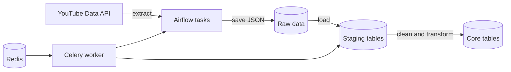

# YouTube Analytics Pipeline

I built this project to get more hands-on experience with data pipelines and Apache Airflow. It pulls public video statistics from the YouTube Data API, saves a raw JSON copy, and loads the results into PostgreSQL.

The pipeline runs locally with Docker Compose. Airflow handles the workflow, PostgreSQL stores the data, and Redis and Celery run the tasks.

## How it works



1. The extraction DAG looks up a channel and gets its uploaded videos.
2. Video IDs are requested in batches of 50 to stay within the API limit.
3. The response is saved as a dated JSON file before any transformations are made.
4. A second DAG loads the data into staging tables, converts the video duration, and updates the core tables.
5. Videos that are no longer in the latest extract are removed from the database.

The core table also labels videos as `short` or `normal` using a 60-second cutoff.

## What I worked on

- Built the extraction and database workflows with Airflow's TaskFlow API
- Added pagination and batched requests for the YouTube API
- Designed separate staging and core schemas in PostgreSQL
- Wrote update, insert, and deletion logic so the pipeline can be run more than once
- Added tests for the ISO 8601 duration conversion and short-video classification
- Put the full local setup into Docker Compose

## Running it locally

You will need Docker Desktop and a YouTube Data API v3 key.

```bash
git clone https://github.com/gxorge13/youtube-analytics-pipeline.git
cd youtube-analytics-pipeline
cp .env.example .env
```

Add your API key to `.env`. You can also change `CHANNEL_HANDLE` if you want to collect data for a different public channel.

```bash
docker compose up --build -d
```

Open <http://localhost:8080>, sign in with the local credentials from `.env`, enable the `produce_json` DAG, and trigger it. It will collect the data and then start the database update DAG.

To stop everything and remove the local database volumes:

```bash
docker compose down --volumes
```

## Tests

The transformation tests do not need Airflow or Docker:

```bash
python -m unittest discover -s tests -v
```

## Project structure

| Path | What it contains |
| --- | --- |
| [`dags/main.py`](dags/main.py) | The two Airflow DAGs |
| [`dags/api/video_stats.py`](dags/api/video_stats.py) | YouTube API requests and pagination |
| [`dags/api/datawarehouse/`](dags/api/datawarehouse/) | Database loading and transformations |
| [`data/sample_video_stats.json`](data/sample_video_stats.json) | A small example using made-up data |
| [`tests/`](tests/) | Tests for the transformation code |
| [`docker-compose.yaml`](docker-compose.yaml) | Airflow, PostgreSQL, Redis, and Celery services |

## Current limitations

- The project is meant to run locally, and the default credentials should not be used for a deployed version.
- YouTube API quotas limit how much data can be collected at once.
- Durations of one day or longer are rejected because the core table currently stores duration as PostgreSQL `TIME`.
- The transformation code has unit tests, but the complete pipeline still needs Docker and a real API key to test.

If I continue developing this, the next things I would add are batched database upserts, data-quality checks, and a small dashboard for viewing channel trends.
