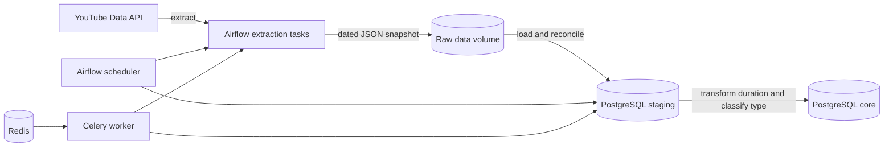

# YouTube Analytics Pipeline

A containerized data pipeline that extracts public channel and video statistics from the YouTube Data API, preserves a raw JSON snapshot, and loads normalized records into staging and core PostgreSQL schemas.

Built as a portfolio project to explore orchestration, incremental warehouse updates, data transformation, and reproducible local infrastructure.

## Architecture



## What it demonstrates

- TaskFlow-based extraction with pagination and batches of up to 50 video IDs per API request.
- A daily raw JSON snapshot before warehouse loading.
- Staging and core schemas with insert, update, and deletion reconciliation.
- ISO 8601 duration transformation and short-form video classification.
- Airflow orchestration with PostgreSQL, Redis, and Celery, all defined in Docker Compose.
- Parameterized SQL for record deletion and unit-tested transformation logic.
- Runtime loading of the API key, keeping credentials out of DAG discovery and source control.

## Repository map

| Path | Purpose |
| --- | --- |
| [`dags/main.py`](dags/main.py) | Extraction and database-load orchestration |
| [`dags/api/video_stats.py`](dags/api/video_stats.py) | YouTube API pagination and metric extraction |
| [`dags/api/datawarehouse/`](dags/api/datawarehouse/) | PostgreSQL schemas, reconciliation, and transformations |
| [`data/sample_video_stats.json`](data/sample_video_stats.json) | Synthetic example matching the extraction schema |
| [`tests/`](tests/) | Dependency-free transformation tests |
| [`docker-compose.yaml`](docker-compose.yaml) | Local Airflow, PostgreSQL, Redis, and Celery stack |

## Quick start

Prerequisites: Docker Desktop with at least 4 GB of memory available, plus a YouTube Data API v3 key restricted to that API.

```bash
git clone https://github.com/gxorge13/youtube-analytics-pipeline.git
cd youtube-analytics-pipeline
cp .env.example .env
```

Replace `API_KEY` in `.env` and optionally change `CHANNEL_HANDLE`. Then initialize and start the stack:

```bash
docker compose up --build -d
```

Open <http://localhost:8080>, sign in with the local credentials from `.env`, enable `produce_json`, and trigger it. The extraction DAG writes a dated snapshot and then triggers `update_db` to reconcile the staging and core tables.

Stop the environment and remove its local volumes with:

```bash
docker compose down --volumes
```

## Run the tests

The transformation tests use only the Python standard library:

```bash
python -m unittest discover -s tests -v
```

They cover valid and invalid ISO 8601 durations, the 60-second short-form boundary, input immutability, and the PostgreSQL `TIME` storage limit.

## Data model

The staging schema retains the API representation. The core schema converts the duration to a PostgreSQL `TIME` value and adds `Video_Type` (`short` for durations up to 60 seconds, otherwise `normal`). Video IDs are primary keys, allowing repeat runs to update current engagement counts and remove records no longer returned for the selected channel.

## Security and operating limits

- `.env` and dated API extracts are ignored. The checked-in sample is synthetic.
- Use a restricted API key and rotate it immediately if it is exposed.
- The Compose stack uses development credentials and is intended only for local demonstration.
- YouTube API quotas constrain extraction volume. The project does not store comments or private user data.
- The core schema currently rejects videos lasting one day or more because PostgreSQL `TIME` is used for duration storage.
- The pipeline has unit coverage for pure transformations. A live API and full-container integration run require user-provided credentials and Docker Desktop.

## Future improvements

- Replace row-at-a-time writes with batched PostgreSQL upserts.
- Add data-quality checks for uniqueness, nonnegative metrics, and staging/core row parity.
- Add an analytics layer for engagement trends and channel-level summaries.
